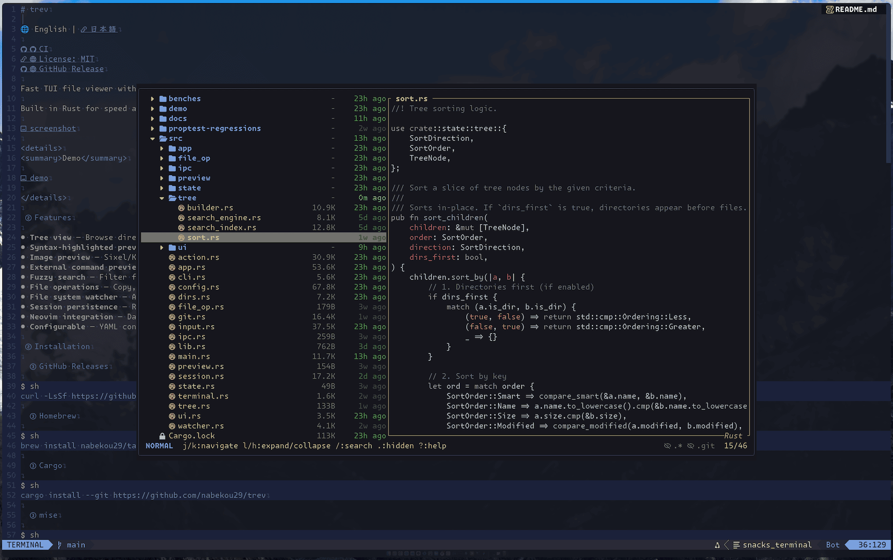

# trev.nvim

[English](README.md)

[trev](https://github.com/nabekou29/trev) の Neovim プラグイン — 高速なファイルツリーエクスプローラー。



trev 本体の詳細（機能、インストール、デーモンの設定など）については [trev リポジトリ](https://github.com/nabekou29/trev) を参照してください。

## 必要要件

- Neovim >= 0.10.0
- [trev](https://github.com/nabekou29/trev)

## インストール

[lazy.nvim](https://github.com/folke/lazy.nvim) の場合:

```lua
{
  "nabekou29/trev.nvim",
  cmd = { "Trev" },
  keys = {
    { "<leader>e", function() require("trev").show() end, desc = "Show trev" },
    { "<leader>E", function() require("trev").show({ position = "float" }) end, desc = "Show trev (float)" },
  },
  opts = {
    width = 60,
    keybindings = {
      -- chowcho.nvim を使ってウィンドウを選択してファイルを開く
      -- ["<S-CR>"] = {
      --   action = function(event)
      --     require("trev").close()
      --     require("chowcho").run(function(winid)
      --       vim.api.nvim_set_current_win(winid)
      --       vim.cmd("edit " .. vim.fn.fnameescape(event.current_file))
      --     end)
      --   end,
      --   context = { "file" },
      --   description = "Open with window picker",
      -- },
    },
  },
}
```

## 設定

```lua
require("trev").setup({
  -- trev バイナリのパス
  trev_path = "trev",
  -- trev に渡す追加の CLI 引数 (例: {"--config", "path/to/config.yml", "--icons"})
  args = {},
  -- サイドパネルの表示位置: "left" | "right"
  side = "left",
  -- サイドパネルの幅（カラム数）
  width = 60,
  -- フローティングウィンドウのサイズ (native アダプターのみデフォルト適用)
  float = {
    width = 0.8,  -- エディタ幅に対する割合 (0.0-1.0) または絶対値 (native デフォルト: 0.8)
    height = 0.8, -- エディタ高さに対する割合 (0.0-1.0) または絶対値 (native デフォルト: 0.8)
  },
  -- BufEnter 時に現在のバッファをツリーで自動表示
  auto_reveal = true,
  -- ターミナルアダプター: "auto" | "toggleterm" | "snacks" | "native"
  -- "auto" は snacks > toggleterm > native の優先順で自動選択
  adapter = "auto",
  -- デフォルトキーバインドを有効にする (<CR> = open, q = quit)
  default_keybindings = true,
  -- Neovim プレビューオーバーレイ (treesitter ハイライト + diagnostics)
  neovim_preview = {
    enabled = false,   -- Neovim プレビューオーバーレイを有効化
    priority = "high", -- trev のプレビューコマンドの優先度 ("high"|"mid"|"low" または数値)
  },
  -- カスタム通知ハンドラー
  handlers = {},
  -- キーバインディング定義 (false を設定するとデフォルトを無効化)
  keybindings = {},
})
```

## 使い方

### コマンド

```vim
:Trev [action] [position] [dir=path] [reveal=path]
```

| Action    | 説明                          |
| --------- | ----------------------------- |
| *(なし)*  | 表示の切り替え（デフォルト）  |
| `focus`   | ツリーを表示してフォーカス    |
| `show`    | フォーカスを移動せず表示      |
| `close`   | ツリーを非表示にする          |
| `reveal`  | ツリー内でファイルを表示      |
| `quit`    | trev デーモンを終了           |

| Position  | 説明                           |
| --------- | ------------------------------ |
| *(なし)*  | パネルモード（デフォルト）     |
| `float`   | フローティングウィンドウモード |

例:

```vim
:Trev                    " パネルの切り替え
:Trev float              " フローティングウィンドウの切り替え
:Trev focus float        " フローティングウィンドウを開いてフォーカス
:Trev reveal=src/main.rs " 特定のファイルを表示
:Trev dir=~/projects/foo " 特定のディレクトリでツリーを開く
```

### Lua API

```lua
local trev = require("trev")

trev.toggle()                          -- パネルの切り替え
trev.toggle({ position = "float" })    -- フローティングウィンドウの切り替え
trev.focus()                           -- 表示してフォーカス
trev.show()                            -- フォーカスを移動せず表示
trev.close()                           -- 非表示（デーモンは維持）
trev.reveal()                          -- 現在のバッファをツリーで表示
trev.reveal("/path/to/file")           -- 特定のファイルをツリーで表示
trev.quit()                            -- デーモンを終了
```

### キーマップ

```lua
vim.keymap.set("n", "<leader>e", function() require("trev").show() end)
vim.keymap.set("n", "<leader>E", function() require("trev").show({ position = "float" }) end)
```

## Neovim プレビュー

Neovim プレビューオーバーレイは、trev 組み込みのプレビューの代わりに Neovim の treesitter ハイライトと diagnostics を使用してファイルプレビューを表示します。Neovim と同じシンタックスハイライトを求める方におすすめの機能です。ただし、動作が不安定になる場合があります。

デフォルトでは無効です。有効にするには:

```lua
require("trev").setup({
  neovim_preview = {
    enabled = true,
  },
})
```

## キーバインディング

キーバインディングは **trev ツリー内** でのキー操作を定義します。

### デフォルトキーバインド

| キー   | アクション | 説明             |
| ------ | ---------- | ---------------- |
| `<CR>` | `open`     | ファイルを開く   |
| `q`    | `quit`     | trev を終了      |

デフォルトキーバインドを個別に無効化するには `false` を設定します:

```lua
require("trev").setup({
  keybindings = {
    ["q"] = false, -- デフォルトの quit を無効化
  },
})
```

すべてのデフォルトキーバインドを無効化するには:

```lua
require("trev").setup({
  default_keybindings = false,
})
```

### 定義済みアクション

`require("trev.actions")` の定義済みアクションをキーバインドで使用できます:

| アクション         | タイプ | コンテキスト | 説明                    |
| ------------------ | ------ | ------------ | ----------------------- |
| `open()`           | notify | file         | Neovim でファイルを開く |
| `toggle_expand()`  | action | directory    | 展開/折りたたみの切替   |
| `quit()`           | action | universal    | trev を終了             |

```lua
local actions = require("trev.actions")

require("trev").setup({
  keybindings = {
    ["<CR>"] = { actions.open(), actions.toggle_expand() },
    ["o"] = actions.open(),
  },
})
```

各アクションはオーバーライドを受け付けます: `actions.open({ context = { "universal" } })`

### カスタムキーバインド

```lua
require("trev").setup({
  keybindings = {
    ["<C-v>"] = {
      action = function(event)
        vim.cmd("vsplit " .. vim.fn.fnameescape(event.current_file))
      end,
      context = { "file" },
      description = "Open in vertical split",
    },
  },
})
```

コールバックは `trev.KeybindingEvent` を受け取ります:

| フィールド     | 型      | 説明                         |
| -------------- | ------- | ---------------------------- |
| `current_file` | string  | アイテムの絶対パス           |
| `dir`          | string  | ディレクトリパス             |
| `name`         | string  | ベースネーム                 |
| `root`         | string  | ワークスペースルート         |
| `is_dir`       | boolean | ディレクトリかどうか         |

## ライセンス

[MIT](LICENSE)
